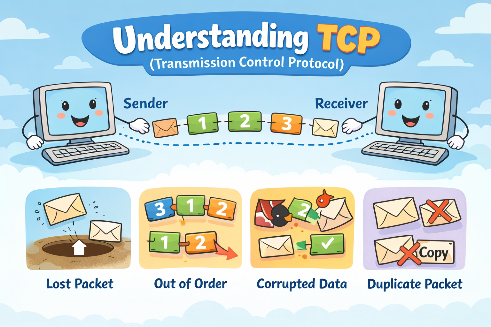
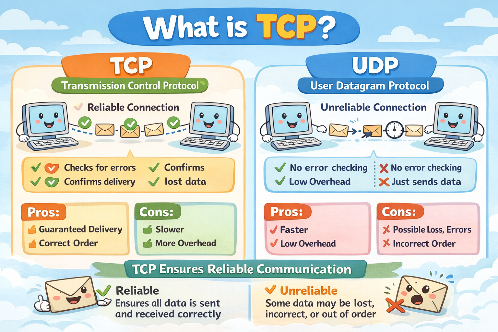
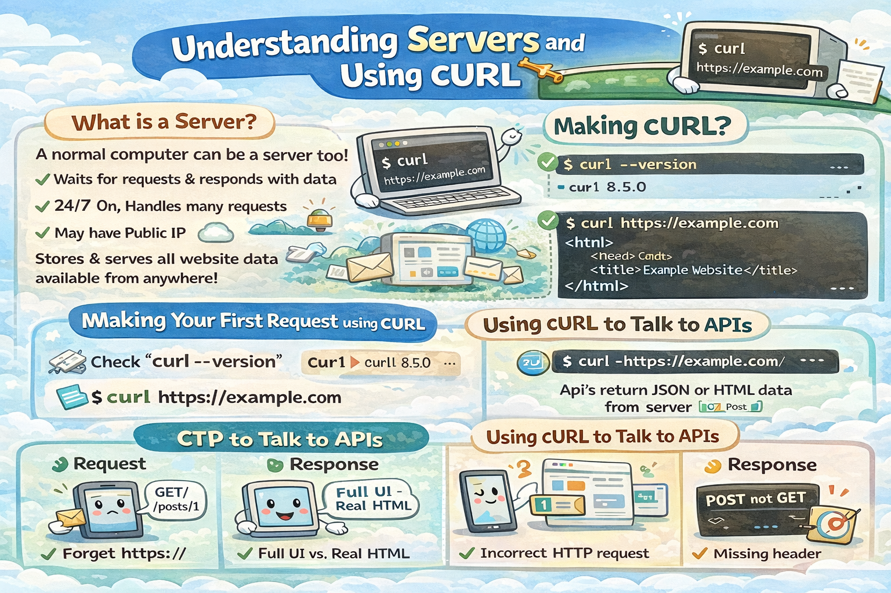

# 📚 Blogs Archive  

Showcase of my journey in tech 🚀  
From fundamentals to real-world concepts.

---

### **[Domain Name System](https://mehtabblogs.hashnode.dev/how-dns-resolution-works)**  

---

### **[DNS Record Types](https://mehtabblogs.hashnode.dev/understanding-dns-record-types)**  

---

### **[Network Devices Guide](https://mehtabblogs.hashnode.dev/a-complete-guide-to-network-devices)**  

---

### **[Version Control](https://mehtabblogs.hashnode.dev/exploring-version-control)**  

---

### **[Git Basics](https://mehtabblogs.hashnode.dev/git-for-beginners)**  

---

### **[How Git Works](https://mehtabblogs.hashnode.dev/how-git-works-internally)**  

---

### **[Understanding TCP](https://mehtabblogs.hashnode.dev/tcp-working-3-way-handshake-and-reliable-communication)**  

---

### **[Difference between TCP and UDP](https://mehtabblogs.hashnode.dev/use-of-tcp-and-udp)**  

---

### **[Understand cURL](https://mehtabblogs.hashnode.dev/easy-steps-for-getting-started-with-curl)**  

---

### **[How Browser works](https://mehtabblogs.hashnode.dev/how-a-browser-works)**  

---

### **[Understanding HTML Tags and Elements](https://mehtabblogs.hashnode.dev/understanding-html-tags-and-elements)**  

---

### **[CSS Selectors 101: Targeting Elements with Precision](https://mehtabblogs.hashnode.dev/css-selectors)**  

---

### **[CSS Selectors 101: Targeting Elements with Precision](https://mehtabblogs.hashnode.dev/css-selectors)**  

---

