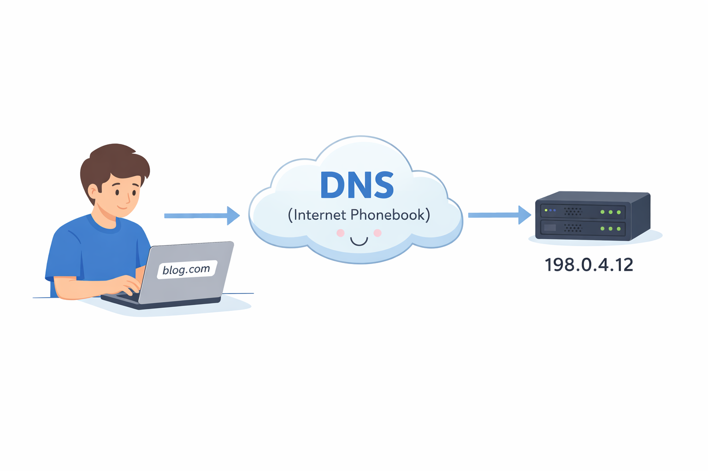
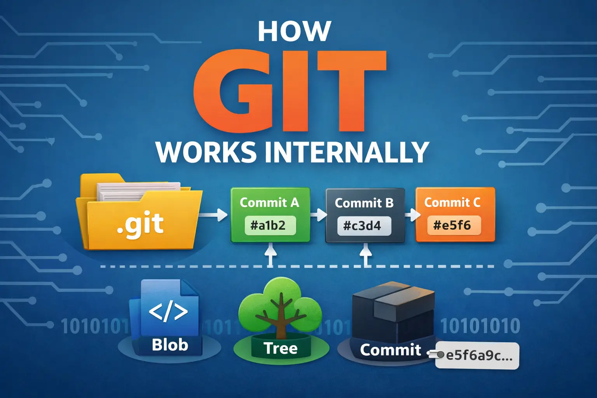

# 📚 Blogs Archive  

Showcase of my journey in tech 🚀  
From fundamentals to real-world concepts.

---

### **[Domain Name System](https://mehtabblogs.hashnode.dev/how-dns-resolution-works)**  

---

### **[DNS Record Types](https://mehtabblogs.hashnode.dev/understanding-dns-record-types)**  

---

### **[Network Devices Guide](https://mehtabblogs.hashnode.dev/a-complete-guide-to-network-devices)**  

---

### **[Version Control](https://mehtabblogs.hashnode.dev/exploring-version-control)**  

---

### **[Git Basics](https://mehtabblogs.hashnode.dev/git-for-beginners)**  

---

### **[How Git Works](https://mehtabblogs.hashnode.dev/how-git-works-internally)**  

---

